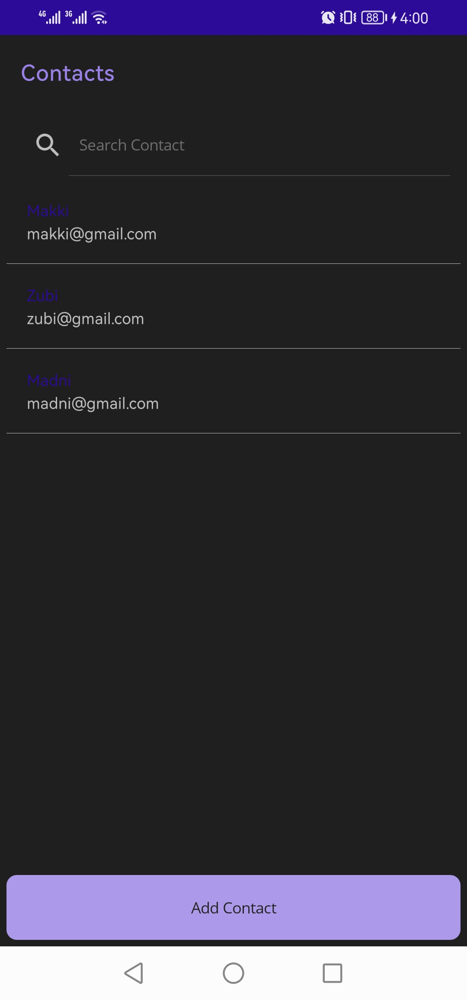
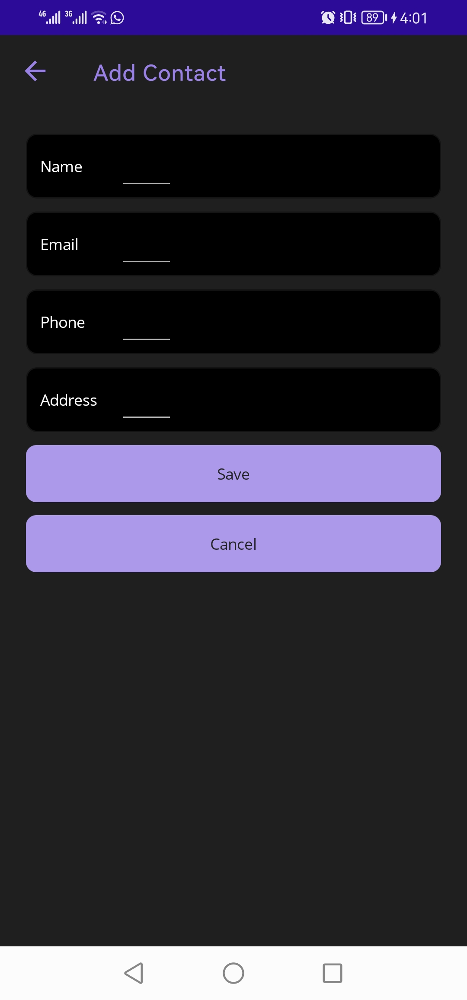
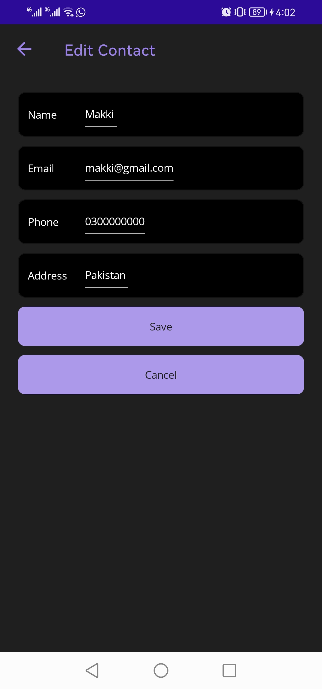

# Contacts.MAUI

Contacts.MAUI is a cross-platform mobile application built with .NET MAUI (Multi-platform App UI). This app allows users to manage and store their contacts efficiently across different devices, leveraging the capabilities of .NET MAUI to create a seamless and responsive user experience.

## Features

- **Cross-Platform Compatibility**: Runs on Android, iOS, macOS, and Windows.
- **Contact Management**: Add, edit, and delete contacts easily.
- **Search Functionality**: Quickly search through your contact list.
- **Responsive UI**: A consistent and user-friendly interface across all platforms.
- **Data Persistence**: Contacts are stored securely and persist across sessions.

## Screenshots


*Caption*: The home screen of the app showing the contact list.


*Caption*: The add contact screen, where users can enter new contact details.


*Caption*: The edit contact screen, allowing users to modify existing contacts.

## Installation

To run this project locally, follow these steps:

### Prerequisites

- [.NET 7 SDK](https://dotnet.microsoft.com/download/dotnet/7.0)
- Visual Studio 2022 (with .NET MAUI workload installed)
- macOS or Windows operating system

### Clone the Repository

```bash
git clone https://github.com/MakkiAbid/Contacts.MAUI.git
cd Contacts.MAUI
```

### Restore and Build the Project

```bash
dotnet restore
dotnet build
```

### Run the Application

#### On Windows

```bash
dotnet build -t:Run -f net7.0-windows10.0.19041.0
```

#### On Android/iOS/macOS

You can run the app directly from Visual Studio by selecting the appropriate target platform and clicking the run button.

## Usage

1. **Launch the app**: After successful installation, open the app on your device.
2. **Manage Contacts**: Use the interface to add, edit, or delete contacts.
3. **Search Contacts**: Use the search bar at the top of the contact list to find specific contacts quickly.
